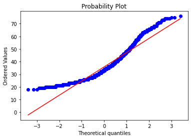
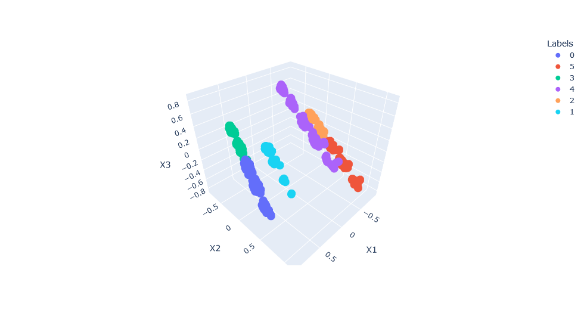

# Kaggle: Customers Clustering Problem
In this notebook I explore clustering techniques for mall customers analysis. Before applying any clustering some exploratory data analysis is performed to explore dataset closely. While performing EDA one can notice that some of the data is not normally distributed. To check it one can perform hypothesis testing. Plotting the results it is obvious that data is not normally distributed and that the null hypothesis can be rejected. 

Given that Kmeans, for example, assumes that the data is normally distributed it is suggested to transform data to fit the desired distribution. After performing all the neccessary data preprocessing, now it is time to apply some clustering techniques such as Kmeans and Hierarchical Clustering. To be able to plot the results one has to perform some dimentionality reduction and reduce the number of features by combining them into new features that share similarities. Finally results are plotted in 3D space.
 
